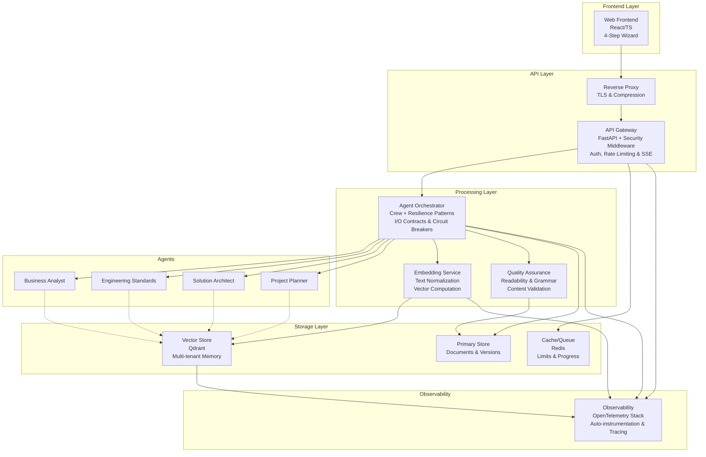
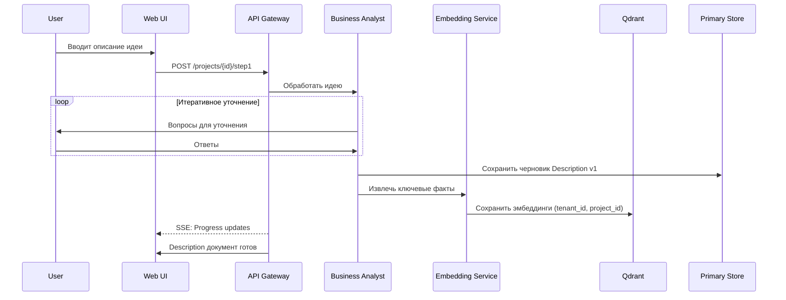
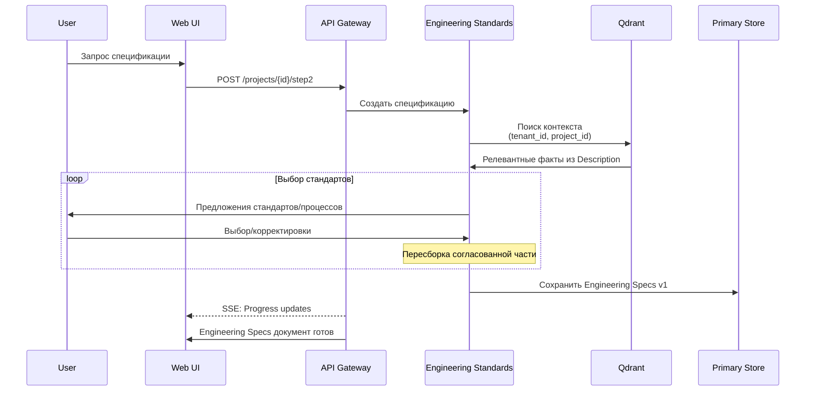
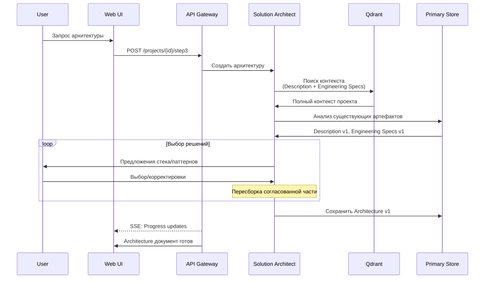
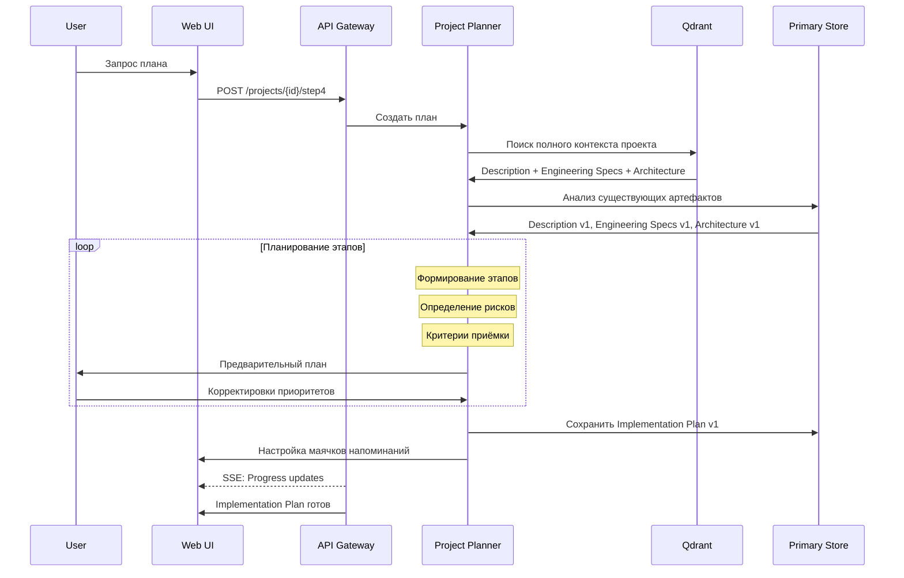
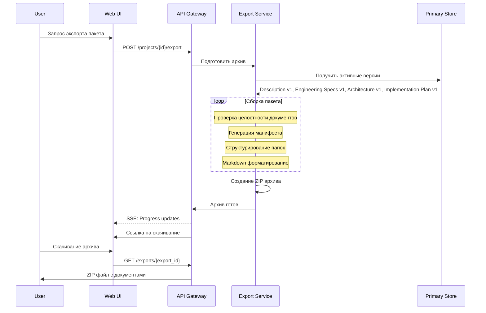

# Архитектура JEEX Plan

> **Техническая спецификация:** Детальные технические требования, API, схемы БД и конфигурации описаны в [specs.md](specs.md)

## 1) Назначение и границы

- Продукт превращает «сырую» идею в профессиональный пакет Markdown-документов: Description → Engineering Specs → Architecture → Implementation Plan.
- Формат работы — диалоговый мастер из 4 шагов с понятным прогрессом и возможностью быстрой итерации (правки в диалоге автоматически попадают в документы).
- Ценностные требования: изоляция знаний между проектами/тенантами, воспроизводимость (версионирование документов), объяснимость результатов (структурные шаблоны, валидации), скорость отклика (стриминг), расширяемость (подключаемые партнёрские рекомендации).

## 2) Архитектурные принципы

- **Single-Responsibility компонентов**: UI, API, оркестрация агентов, память/поиск, долговременное хранилище, кэш/квоты, экспорт, наблюдаемость.
- **Чёткий контекст проекта**: любой агент и любой поиск работают только в пределах `(tenant_id, project_id)`.
- **Server-side enforcement**: клиент никогда не задаёт фильтры напрямую для памяти/поиска; фильтр формируется и подписывается на бэкенде.
- **Потоковая отдача**: все длинные операции отдают прогресс и промежуточные результаты через SSE.
- **Версионирование как договор**: каждая значимая генерация/правка — новая версия артефакта, чтобы пользователь в любой момент мог «свернуть» изменения.
- **Наблюдаемость по умолчанию**: OpenTelemetry для distributed tracing с корреляционными ID и автоматической инструментацией FastAPI.
- **Resilience patterns**: Tenacity для retry logic и circuit breakers при взаимодействии с внешними LLM API для предотвращения каскадных сбоев.

## 3) Логическая схема (высокоуровнево)



**Состав:**

- **Web Frontend** (React/TS): мастер из 4 шагов, предпросмотр и дифф-подсветка, панель прогресса, скачивание архива.
- **API-шлюз / Backend** (FastAPI): аутентификация (OAuth2), SSE-стриминг, лимиты, сбор/агрегация телеметрии, экспорт, партнёрские рекомендации.
- **Оркестратор агентов** (Crew-подход + строгие контрактные модели I/O): роли Business Analyst, Engineering Standards, Solution Architect, Project Planner.
- **Сервис эмбеддингов** (абстракция над выбранной моделью): нормализация текста, чанкинг, дедупликация, вычисление векторов.
- **Vector Store** (Qdrant): память/контекст проекта, поиск знаний с фильтрами по тенанту/проекту; мультитенантный подход (см. раздел 6).
- **Primary Store** (документы/версии/настройки): долговременное хранение артефактов и истории.
- **Cache/Queue** (Redis): антишторм-буферы, очереди эмбеддингов, токен-бункеты лимитов, быстрые флаги прогресса.
- **Observability** (OTel-стек): трейсы генераций/поиска, дашборды SLO, алерты.
- **Reverse Proxy**: TLS, компрессия, passthrough SSE, базовая защита.

## 4) Ключевые пользовательские потоки

### 4.1 Описание идеи → первичная память и черновик



- Пользователь излагает идею; Business Analyst уточняет и формирует структурный черновик Description.
- Черновик сразу сохраняется как версия документа; важные фрагменты и «факты» попадают в память проекта (эмбеддинги в Qdrant) в жёстком серверном скоупе `(tenant_id, project_id)`.
- SSE отдаёт прогресс (например, чек-пункты шаблона).

### 4.2 Спецификация



- Engineering Standards извлекает контекст из памяти проекта (поиск только внутри текущего тенанта и проекта), предлагает технические требования и стандарты разработки, собирает документ Engineering Specs.
- Пользователь может быстро заменить подходы (например, TDD → BDD) — пересобирается согласованная часть документации.

### 4.3 Архитектура



- Solution Architect извлекает контекст из памяти проекта (поиск только внутри текущего тенанта и проекта), предлагает решения (стек, паттерны, компромиссы), собирает документ Architecture на основе описания проекта и инженерных спецификаций.
- Пользователь может быстро заменить решения (например, Postgres → ClickHouse) — пересобирается согласованная часть документации.

### 4.4 Планирование



- Project Planner строит верхнеуровневый Implementation Plan: этапы, критерии приёмки, риски/зависимости, контрольные события на основе всех предыдущих документов.
- Настраиваются «маячки» для последующих напоминаний (например, «вернуться к интеграции партнёра Х»), которые отображаются в UI.

### 4.5 Финал — экспорт пакета



- API собирает «срез» активных версий артефактов на момент экспорта, формирует архив с чистой структурой папок Markdown.

## 5) Компоненты и их связи (подробно)

### 5.1 Frontend

- Одностраничный мастер с 4 шагами, каждый шаг — самостоятельный «чеклист» качества (заполняемость ключевых блоков).
- Дифф-подсветка между версиями документа; «быстрые кнопки» для принятия/отката.
- Прогресс-бар шага и общего процесса; состояние устойчиво к перезагрузке вкладки (стейт подтягивается из бэкенда).
- Изоляция проектов по URL: `app.tld/{tenant}/{project}` (path-based), с опцией вынести проекты крупных клиентов на поддомены при необходимости изоляции cookie/политик CORS.

### 5.2 API / Backend

- Аутентификация OAuth2; авторизация на основе ролей проекта (owner, editor, viewer).
- SSE-эндпоинты для прогресса генераций; backpressure-контроль, таймауты, реконнект.
- Rate-limiting: глобальные, per-tenant и per-project; отдельные квоты на токены LLM/эмбеддинги.
- Экспорт архива: сбор «активных» версий артефактов, генерация манифеста состава.

### 5.3 Оркестратор агентов

**Специализированные роли агентов:**

- **Business Analyst** — эксперт по product discovery и бизнес-анализу: исследует проблемную область, выявляет потребности пользователей, формулирует бизнес-цели и KPI, анализирует риски и ограничения
- **Engineering Standards** — senior engineer с экспертизой в code quality и best practices: формирует coding guidelines, определяет процессы code review, устанавливает Definition of Done и тестовые стандарты на основе описания проекта
- **Solution Architect** — технический архитектор с экспертизой в проектировании систем: выбирает технологический стек, проектирует компоненты и интеграции, обосновывает архитектурные решения и trade-offs с учетом установленных стандартов
- **Project Planner** — специалист по планированию разработки и управлению проектами: декомпозирует задачи, оценивает временные рамки, выявляет зависимости и bottlenecks, планирует milestone'ы на основе всех предыдущих артефактов

**Принципы работы:**

- Явные контракты I/O (строгая схема полей, чеклисты валидации), единый «контекст исполнения» с корреляционным ID.
- Итеративные циклы: уточнения → генерация → валидация → фиксация версии → (при необходимости) доработка.
- Жёсткое правило контекста: агенты читают память только в скоупе проекта; кросс-проектные запросы недоступны.

### 5.4 Сервис эмбеддингов

- Единая модель эмбеддингов на уровне MVP, чтобы сохранять однородность поиска и использовать мультитенантный подход в Qdrant эффективно (единая конфигурация векторов у всех тенантов).
- Политики чанкинга и фильтры (удаление стоп-сигналов, сжатие повторов), дедупликация перед записью в Vector Store.
- Контроль качества индекса: периодическая переиндексация «устаревших» фрагментов после значимых правок.

### 5.5 Vector Store (Qdrant) — Мультитенантный подход

- **Единая коллекция** с логическим разделением тенантов через payload-фильтрацию
- **Строгая изоляция:** все запросы выполняются только в контексте `(tenant_id, project_id)`
- **Оптимизированная конфигурация** для мультитенантных сред
- **Стратегии масштабирования:** от общего подхода до выделенных кластеров для крупных клиентов

> Подробные технические детали, включая конфигурацию HNSW и стратегии шардинга, описаны в [specs.md](specs.md). Дополнительно см. [The Tao of Qdrant Multi-tenancy](https://medium.com/qdrant/the-tao-of-qdrant-multi-tenancy-162c71f830fb).

### 5.6 Primary Store (артефакты и версии)

- Документы и их версии — «истина» для экспорта и отображения; память (Qdrant) — «индекс и контекст» для мышления агентов.
- Версионирование линейное в MVP с метаданными (кто/когда/почему), чтобы обеспечить объяснимость и быстрый откат.

### 5.7 Cache/Queue (Redis)

- Очередь вычисления эмбеддингов; антишторм-буферы при всплесках генераций; контрольные ключи прогресса для SSE.
- Токен-бюджеты на тенант/проект; смягчение «noisy neighbor» со стороны агентов (ограничение параллелизма).

### 5.8 Observability

- Сквозные трассы: шаг пользователя → вызовы агентов → эмбеддинги → Qdrant/Primary Store → экспорт; единый correlation-id.
- SLO дашборды: latency P50/P95 генераций, доля успешных экспортов, ошибки поиска, процент «пустых» релевантов.

### 5.9 Security & Privacy

- TLS везде; секреты только на сервере; принцип наименьших прав до уровня проекта.
- RBAC: владелец проекта, редактор, просмотровый доступ (включая публичный read-only флаг для публикаций).
- Политики хранения: ограничение сроков для логов с чувствительными фрагментами промптов/контекста; трейс-семплинг без персональных данных.

## 6) Мультитенантная модель памяти

**Подход:** единая коллекция Qdrant с логическим разделением через payload-фильтрацию.

**Принципы изоляции:**

- Все запросы строго в контексте `(tenant_id, project_id)`
- Серверная фильтрация — клиент не может обойти ограничения
- Оптимизированная конфигурация для производительности

> Детальные технические спецификации, включая конфигурацию HNSW, описаны в [specs.md](specs.md)

## 7) Масштабирование и производительность

- **Поиск**: мультитенантный подход + индекс по `tenant_id` обеспечивают устойчивую скорость на рост числа клиентов; оптимизация размещения векторов тенанта в Qdrant 1.11+ снижает I/O операции
- **Горизонтальный рост**: добавление узлов/шардов Qdrant; при необходимости — перенос отдельных клиентов на custom sharding/выделенный кластер (гибрид)
- **Оркестрация**: ограничение параллелизма на агента и на проект; очереди эмбеддингов; стратегия backoff при «узких местах»
- **Экспорт**: формирование архива из активных версий без блокирующего чтения всей истории

## 8) Развёртывание и окружения

### 8.1 Архитектура развёртывания

**Frontend:** Выполняется локально (Node.js/Vite) на порту 5200, не контейнеризован для удобства разработки

**Backend и инфраструктура:** Контейнеризованы через Docker Compose

**Порты:**

- Frontend (локально): 5200
- API: 5210
- PostgreSQL: 5220
- Qdrant: 5230
- Redis: 5240
- Nginx: 80, 443
- OpenTelemetry Collector: 4317, 4318, 8888
- HashiCorp Vault: 5250

### 8.2 Компоненты развёртывания

- **Среды:** dev / stage / prod; одинаковые артефакты контейнеров; единая модель эмбеддингов для всех в MVP (соответствует мультитенантному подходу)
- **Сетевые границы:** nginx с TLS, frontend через host.docker.internal:5200, приватные сети для Qdrant/Primary/Redis
- **Региональность:** по мере роста — региональные кластеры по требованию клиентов с учётом требований к размещению данных

### 8.3 Локальный стек

```yaml
services:
  # Инфраструктура (контейнеризована)
  - nginx: Reverse proxy и TLS терминация
  - api: FastAPI backend
  - postgres: PostgreSQL 18 with UUID v7 and AIO
  - redis: Cache и очереди
  - qdrant: Vector database
  - otel-collector: Телеметрия
  - vault: Управление секретами

  # Frontend (локально)
  - React/Vite на порту 5200
```

> **Управление секретами.** Рабочие токены Vault (`VAULT_TOKEN`,
> `VAULT_DEV_ROOT_TOKEN_ID`) задаём только через переменные окружения или
> локальный файл `.env.local`, который исключён из VCS. В корне репозитория
> хранится версионный шаблон `.env.example` с подсказками по структуре — его
> копируем при настройке окружения. Файлы `.env` с реальными значениями не
> коммитим и храним только локально.

## 9) Критерии качества и SLO

- **Время шага**: P95 генерации одного документа ≤ N секунд при базовом лимите объёма входа.
- **Доступность**: API и SSE ≥ 99.9% в месяц.
- **Безопасность**: 100% запросов к памяти проходят с серверным фильтром; 0 инцидентов кросс-тенантного доступа.

## 10) Риски и смягчение

- **«Шумные соседи»**: квоты на точки/запросы/токены; при превышении — деградация качества (меньше контекста, отложенные эмбеддинги), или перевод крупного клиента на custom sharding
- **Галлюцинации/рассинхрон артефактов**: жёсткие шаблоны и чек-листы валидации, строгие контракты I/O между агентами, явные правила «что считать источником истины»
- **Долгие ответы**: SSE, буферизация, показ промежуточных блоков, кэширование стабильных подсказок
- **Операционные издержки**: мультитенантный подход минимизирует их на старте; гибридная модель — по мере появления крупных клиентов
