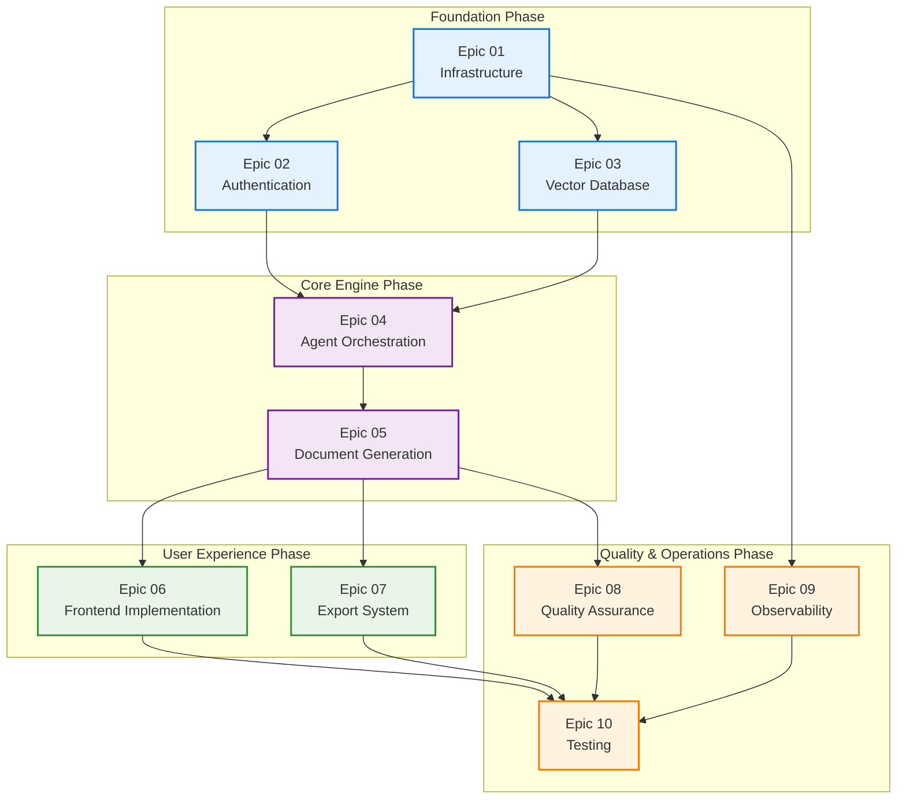

# Delivery Overview — JEEX Plan

## Epic Map

| Epic | Outcome | Primary Owner | Dependencies | Status |
|------|---------|---------------|--------------|---------|
| [01 — Infrastructure](01-infrastructure.md) | Полная архитектура с базовой функциональностью | Backend Developer | None | ⏳ Not Started |
| [02 — Authentication](02-authentication.md) | OAuth2 аутентификация и мультитенантность | Backend Developer | Epic 01 (database, API) | ⏳ Not Started |
| [03 — Vector Database](03-vector-database.md) | Векторный поиск и эмбеддинги | Backend Developer | Epic 01 (infrastructure) | ⏳ Not Started |
| [04 — Agent Orchestration](04-agent-orchestration.md) | CrewAI агенты и мультиагентная система | Backend Developer | Epic 02, 03 (auth, vector store) | ⏳ Not Started |
| [05 — Document Generation](05-document-generation.md) | Четырехэтапная генерация документов | Backend Developer | Epic 04 (agents) | ⏳ Not Started |
| [06 — Frontend Implementation](06-frontend-implementation.md) | React интерфейс с SSE и прогресс-трекингом | Frontend Developer | Epic 05 (document API) | ⏳ Not Started |
| [07 — Export System](07-export-system.md) | ZIP архивы и структурированный экспорт | Backend Developer | Epic 05, 06 (documents, UI) | ⏳ Not Started |
| [08 — Quality Assurance](08-quality-assurance.md) | Валидация контента и обеспечение качества | Backend Developer | Epic 05 (generation) | ⏳ Not Started |
| [09 — Observability](09-observability.md) | OpenTelemetry трассировка и мониторинг | DevOps Engineer | Epic 01 (infrastructure) | ⏳ Not Started |
| [10 — Testing](10-testing.md) | Комплексное тестирование всей системы | QA Engineer | All previous epics | ⏳ Not Started |

## Development Flow

## Technical Requirements

**Минимальные версии компонентов (обязательно к соблюдению):**
- FastAPI 0.116.2+ — современные возможности async и dependency injection
- CrewAI 0.186.1+ — улучшенная оркестрация мультиагентных систем
- Pydantic AI 1.0.8+ — стабильный API для контрактов агентов
- PostgreSQL 18+ — расширенная поддержка JSON/JSONB и производительность
- Qdrant 1.15.4+ — оптимизации мультитенантности и payload фильтрации
- Redis 8.2+ — улучшенная эффективность памяти и pub/sub
- OpenTelemetry 1.27+ — автоинструментация FastAPI и distributed tracing

**Архитектурные ограничения:**
- Strict isolation: все запросы должны включать (tenant_id, project_id) фильтры
- Мультитенантная Qdrant коллекция с payload-фильтрацией
- SSE для real-time обновлений прогресса генерации
- Контейнеризация всех сервисов кроме frontend (локальная разработка)
- Порты: Frontend:5200, API:5210, PostgreSQL:5220, Qdrant:5230, Redis:5240, Vault:5250

## Open Items

| Question/Risk | Owner | Impact | Required By |
|---------------|-------|--------|-------------|
| Выбор LLM провайдера для MVP (OpenAI vs Claude vs multi-provider) | Tech Lead | Medium | Epic 04 start |
| Стратегия обработки long-running генераций (timeout handling) | Backend Developer | High | Epic 05 start |
| Детали интеграции с внешними OAuth провайдерами (Google, GitHub) | Backend Developer | Medium | Epic 02 start |
| Конфигурация HNSW параметров для оптимальной мультитенантности | Backend Developer | Medium | Epic 03 start |
| Стратегия migration existing data при обновлениях схемы | Backend Developer | Low | Epic 01 completion |